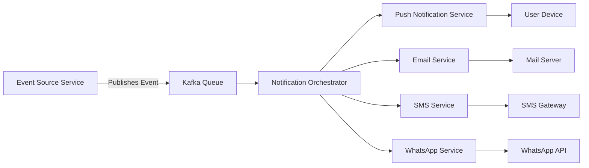
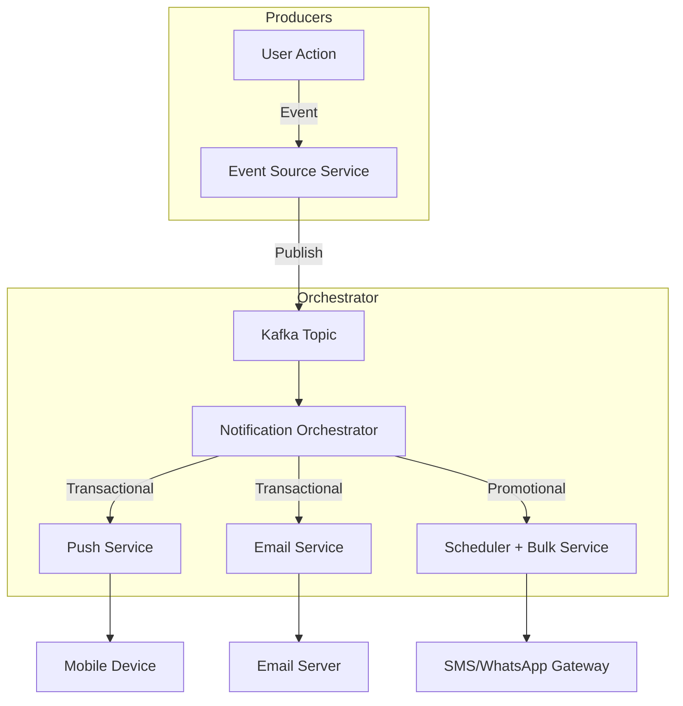

# Day 3: Notification System Design

## 1. Requirements
- Support multiple channels: **Push Notification, Email, SMS, WhatsApp**
- Define different **notification types** (transactional, promotional, alerts, reminders)
- Ability to **schedule promotional notifications**
- Separate **personalized notifications** from **bulk notifications**
- Ensure **scalability** and **reliability**
- Event-driven system

---

## 2. High-Level Architecture

---

## 3. Components

### Event Source
- Generates events like user actions, transactions, or system triggers.
- Publishes messages to **Kafka**.

### Kafka (Message Queue)
- Ensures **decoupling** between services.
- Provides **scalability** and **reliability**.
- Supports **topic-based segregation** (transactional, promotional).

### Notification Orchestrator
- Consumes messages from Kafka.
- Determines notification type (transactional, promotional, bulk, personalized).
- Routes to appropriate channel service.

### Channel Services
- **Push Notification Service**: Delivers to Android/iOS devices.
- **Email Service**: Uses SMTP or external providers like SES/SendGrid.
- **SMS Service**: Uses SMS gateway APIs.
- **WhatsApp Service**: Uses WhatsApp Business API.

---

## 4. Features

### Scheduling
- Promotional notifications can be scheduled using **job schedulers** (Quartz, Cron, etc.).

### Personalization
- Fetches user preferences & templates from **User Profile Service**.

### Bulk Notifications
- Optimized by **batch processing** & **parallel dispatch**.

### Reliability
- Retries on failure using **dead-letter queues**.
- Logs & metrics via **Monitoring Service**.

---

## 5. Scalability Considerations
- Kafka partitions for parallel consumption.
- Horizontal scaling of Orchestrator & Channel Services.
- Cache frequently used templates.

---

## 6. Example Flow
1. A **payment success event** occurs.
2. Event is published to Kafka topic `transactional.notifications`.
3. Orchestrator consumes it, identifies it as **transactional**.
4. Routes to Push Notification + Email service.
5. Services deliver to user device/mailbox.

---

## 7. Diagram (Detailed)

---

## 8. Summary
- Built an **event-driven notification system** using Kafka & microservices.
- Supports **multi-channel delivery**, **scheduling**, **bulk vs personalized messages**.
- Ensures **scalability, reliability, and extensibility**.
