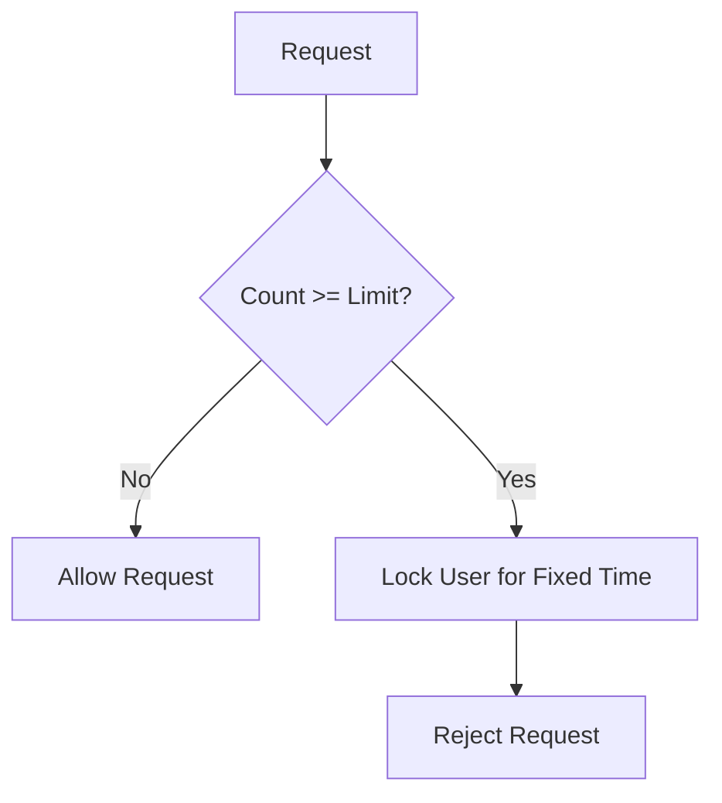

# Day 2: Rate Limiting with Sliding Window & Fixed Time Lockout

## 1. Introduction
In this session, we explored **rate limiting** strategies in distributed systems, focusing on:
1. **Sliding Window Algorithm**
2. **Fixed Time Lockout** mechanism
3. **Concurrency issues** and atomic operations

---

## 2. Sliding Window Algorithm

### Concept
Sliding window rate limiting ensures requests are counted over a **moving time interval** rather than resetting counts at fixed intervals.

#### Key Points:
- Maintains a record of timestamps for each request.
- Periodically removes expired entries.
- Works well for *smoother request distribution* compared to fixed windows.

#### Diagram

```
Time →
|---|---|---|---|---|
    ↑ Window slides forward continuously
```

---

## 3. Fixed Time Lockout

### Concept
After reaching the limit, the user is locked out for a **fixed duration**, regardless of sliding intervals.

#### Pros:
- Simple to implement.
- Predictable lockout periods.

#### Cons:
- May block users even when they would otherwise be under the limit in a sliding window model.

---

## 4. Concurrency Issue

### Problem
If **two requests arrive at the same time**, and both check `count >= limit` before incrementing, they might both pass, exceeding the limit.

### Solution
- Use **atomic operations** (e.g., `AtomicInteger` in Java).
- Use **synchronized blocks** or **distributed locks** in multi-instance systems.

**Example in Java with AtomicInteger:**
```java
AtomicInteger counter = new AtomicInteger(0);

public boolean allowRequest() {
    int current = counter.incrementAndGet();
    return current <= LIMIT;
}
```

---

## 5. Improved Fixed Time Lockout with Atomic Check

Instead of:
```java
if (count > limit) { block user }
count++;
```

Do atomically:
```java
if (counter.incrementAndGet() > LIMIT) {
    block user;
}
```

---

## 6. Summary Table

| Strategy              | Pros                      | Cons                       |
|-----------------------|---------------------------|----------------------------|
| Sliding Window        | Smooth limiting           | More complex to implement  |
| Fixed Time Lockout    | Simple, predictable       | Can be unfair to users     |
| Atomic Operations     | Prevents race conditions  | Needs thread-safe design   |

---

## 7. Diagram for Fixed Time Lockout



---

**Next Steps (Day 3)**: We will dive into **Token Bucket** and **Leaky Bucket** algorithms, which are more efficient for distributed systems.