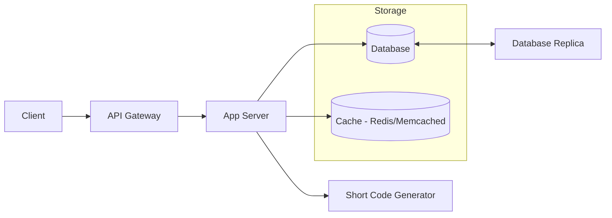

# Day 1 – System Design Learning Document
**Topic:** URL Shortener (Core Concepts & Design Thinking)

---

## 1. Problem Statement
We want to design a service like `bit.ly` that:
- Takes a long URL as input.
- Returns a short, unique URL.
- When the short URL is visited, it redirects to the original URL.
- Must handle millions/billions of URLs efficiently.

---

## 2. Functional Requirements
1. Shorten a given URL.
2. Retrieve the original URL from a shortened one.
3. Handle high read/write traffic.
4. Optional:
   - Set expiration for URLs.
   - Analytics on usage (click counts, geo info).
   - User authentication for custom URLs.

---

## 3. Non-Functional Requirements
- **High availability:** Service should always be up.
- **Low latency:** Short URL lookup must be fast (<10ms ideally).
- **Scalability:** Must handle large data growth.
- **Fault tolerance:** System should survive node failures.

---

## 4. Core Concept: URL Shortening
**Idea:** Map each long URL to a **unique short code**.

### Options for short code generation:
1. **Hashing:**  
   - Apply a hashing algorithm (e.g., MD5, SHA-256) to the URL.
   - Take a fixed number of characters (e.g., 6–8).
   - Use **Base62 encoding** (0-9, a-z, A-Z) to maximize combinations.
   - **Issue:** Possible collisions → need collision resolution.

2. **Auto-increment IDs + Encoding:**  
   - Maintain a counter (e.g., 1, 2, 3...).
   - Encode the number in Base62 to produce a short code.
   - Example:  
     - `1` → `a`  
     - `125` → `cb`  
   - Easy to avoid collisions.

---

## 5. Data Model
A simple relational table could be:

| ShortCode | LongURL                  | CreatedAt   | ExpiryDate  | ClickCount |
|-----------|--------------------------|-------------|-------------|------------|
| aZ1b2C    | https://example.com/abc  | 2025-08-07  | NULL        | 104        |

**Why SQL initially?**
- Data is structured and small per entry.
- ACID transactions for consistency.
- Easy indexing on `ShortCode`.

Later, we can:
- Move to **NoSQL (like DynamoDB, Cassandra)** for horizontal scalability.
- Or use a hybrid: SQL for core mapping, Redis for fast lookups.

---

## 6. Architecture Overview
**Basic flow:**
1. **Client sends long URL** → API Gateway → Application Service.
2. Application Service:
   - Generates short code.
   - Stores mapping in DB.
3. **Client requests short URL** → API Gateway → Service fetches from DB (or cache) → redirects.

**Components:**
- **API Gateway** → Handles routing, authentication, rate limiting.
- **App Server** → Contains URL generation & business logic.
- **Database** → Stores mapping.
- **Cache (Redis/Memcached)** → Stores hot mappings for faster reads.
- **Replication & Backup** → Avoid data loss.

---

## 7. Optimizations
- **Caching**:  
  Store frequently used URLs in Redis for O(1) lookups.

- **Database Replication**:  
  Read from replicas to reduce load on the primary DB.

- **Sharding**:  
  Distribute URLs across DB shards based on hash of short code.

- **Batch cleanup**:  
  Remove expired URLs periodically.

---

## 8. Trade-Offs
| Option                 | Pros                                    | Cons                                |
|------------------------|-----------------------------------------|-------------------------------------|
| Hashing                | No DB dependency for ID generation      | Collisions possible                 |
| Auto-increment + Base62| Simple, no collisions                   | Central counter might bottleneck    |
| SQL DB                 | Easy to start, ACID guarantees          | Not as scalable as NoSQL            |
| NoSQL                  | Highly scalable, distributed            | Eventual consistency issues         |

---

## 9. Key Takeaways from Day 1
- **Always start with requirements** before jumping into tech.
- **Base62 encoding** is common for short codes because it’s compact.
- **Caching** drastically improves read performance.
- **Sharding** and **replication** are essential for scale.
- Keep **collisions and bottlenecks** in mind when generating IDs.

---

## 10. Architecture Diagram
